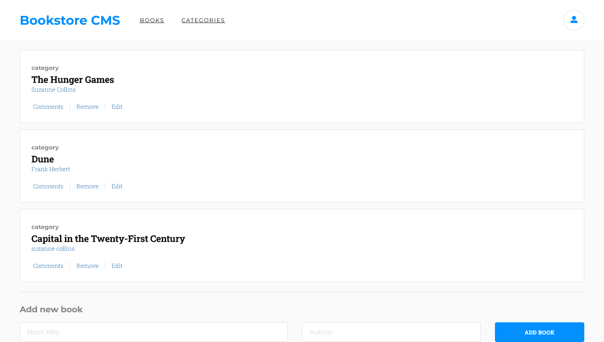

## 📗 Table of Contents <a name="readme-top"></a>

- [📖 Bookstore CMS](#about-project)
  - [Project Objectives](#project-objectives)
  - [🛠 Built With](#built-with)
    - [Tech Stack](#tech-stack)
    - [Key Features](#key-features)
  - [🚀 Live Demo](#live-demo)
- [💻 Getting Started](#getting-started)
  - [Prerequisites](#prerequisites)
  - [Setup](#setup)
  - [Install](#install)
  - [Usage](#usage)
  - [Run tests](#run-tests)
  - [Deployment](#deployment)
- [👥 Authors](#authors)
- [🔭 Future Features](#future-features)
- [🤝 Contributing](#contributing)
- [⭐️ Show your support](#support)
- [🙏 Acknowledgements](#acknowledgements)
- [📝 License](#license)

# 📖 Bookstore CMS <a name="about-project"></a>

Bookstore CMS is a web application that allows users to manage their bookstore. It allows users to add, remove, and edit books. It also allows users to add categories to books. The application is built with React and Redux.

- [x] The application is a single-page app built with React and Redux.
- [x] The user can add a book.
- [x] The user can remove a book.
- [x] The user can edit a book's title and author.
- [x] The user can see a list of all the books.

## Project Objectives <a name="project-objectives"></a>

- [x] create a React app and install basic dependencies as React-Redux.
- [x] create routes and view components (Routers for the app).

<p align="right">(<a href="#readme-top">back to top</a>)</p>

## 🛠 Built With <a name="built-with"></a>

### Tech Stack <a name="tech-stack"></a>

- [react](https://react.dev/)
- [npm](https://www.npmjs.com/)
- [Git](https://git-scm.com/)
- [GitHub](https://github.com)
- [Stylelint](https://stylelint.io/)
- [ESLint](https://eslint.org/)
- [sass](https://sass-lang.com/)
- [VSCode](https://code.visualstudio.com/)
- [react router](https://reactrouter.com/)
- [react redux](https://react-redux.js.org/)
- [react icons](https://react-icons.github.io/react-icons/)

### Key Features <a name="key-features"></a>

- [x] The user can add a book.
- [x] The user can remove a book.
- [x] The user can see a list of all the books.
- [x] the user can change page

<p align="right">(<a href="#readme-top">back to top</a>)</p>

## 🚀 Live Demo <a name="live-demo"></a>

> [Live Demo Link](https://fmanimashaun.github.io/bookstore-cms/)

<p align="center">
  
</P>

<p align="right">(<a href="#readme-top">back to top</a>)</p>

## 💻 Getting Started <a name="getting-started"></a>

### Prerequisites <a name="prerequisites"></a>

- [Optional] Install git bash to your machine to enable you to clone this repo.
- install Visual Studio to be able to host a local live version.
- Install a browser to view the local live version.

To get a local copy up and running follow these simple example steps.
### Setup <a name="setup"></a>

Clone this repository to your desired folder:

```sh
  cd your-desired-folder
  git clone https://github.com/fmanimashaun/bookstore-cms.git
  open the repo folder `bookstore-cms`
```

### Install <a name="install"></a>

Install this project dependencies with:

```sh
  npm install
```

### Usage <a name="usage"></a>

To run the project, execute the following command:

```sh
  npm run start
```

Runs the app in the development mode.\
Open [http://localhost:3000](http://localhost:3000) to view it in your browser.

The page will reload when you make changes.\
You may also see any lint errors in the console.

### Run tests <a name="run-tests"></a>

To run tests to check the lint errors, run the following command:

- To check for CSS lint errors, run the following command:

```sh
  npm run stylelint
```

- To check for JS lint errors, run the following command:

```sh
  npm run eslinter
```

To run unit tests, run the following command:

```sh
  npm run test
```

Launches the test runner in the interactive watch mode.\
See the section about [running tests](https://facebook.github.io/create-react-app/docs/running-tests) for more information.

### Deployment <a name="deployment"></a>

You can deploy this project to github pages by running the following command:

```sh
  npm run deploy

```

Builds the app for production to the `build` folder.\
It correctly bundles React in production mode and optimizes the build for the best performance.

The build is minified and the filenames include the hashes.\
and it is automatically deployed to the github page.

See the section about [github page deployment](https://github.com/gitname/react-gh-pages) for more information.

<p align="right">(<a href="#readme-top">back to top</a>)</p>

## Authors <a name="authors"></a>

👤 **Engr. Animashaun Fisayo**

- [GitHub](https://github.com/fmanimashaun)
- [Twitter](https://twitter.com/fmanimashaun)
- [LinkedIn](https://www.linkedin.com/in/fmanimashaun/)
- [Website](https://fmanimashaun.com)

<p align="right">(<a href="#readme-top">back to top</a>)</p>

## 🔭 Future Features <a name="future-features"></a>

- [ ] Add various page components.
- [ ] Upgrade the book card with new interactive functures
- [ ] Add a progress bar to show the progress of the book.

<p align="right">(<a href="#readme-top">back to top</a>)</p>

## 🤝 Contributing <a name="contributing"></a>

Contributions, issues, and feature requests are welcome!

Feel free to check the [issues page](../../issues/).

<p align="right">(<a href="#readme-top">back to top</a>)</p>

## ⭐️ Show your support <a name="support"></a>

Give a ⭐️ if you like this project!

<p align="right">(<a href="#readme-top">back to top</a>)</p>

## 🙏 Acknowledgements <a name="acknowledgements"></a>

- [Microverse](https://www.microverse.org/)

<p align="right">(<a href="#readme-top">back to top</a>)</p>

## 📝 License <a name="license"></a>
This project is [MIT](./LICENSE) licensed.

<p align="right">(<a href="#readme-top">back to top</a>)</p>
